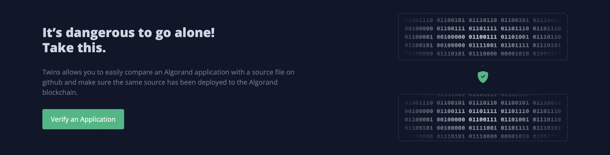
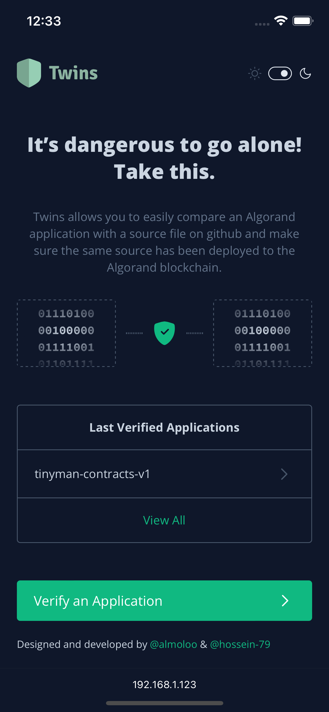
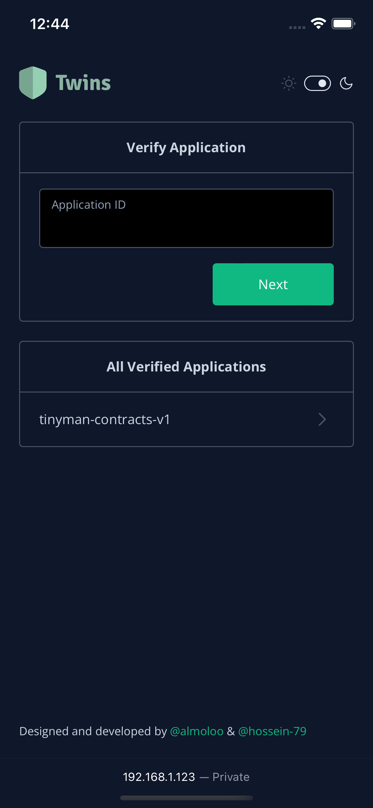
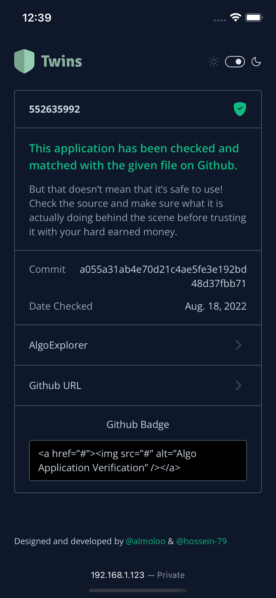

<div align="center">
    <a href="https://github.com/Hossein-79/twins">
        
    </a>
    <h1 align="center">Twins</h1>
    <p align="center">
        A simple and intuitive web application built with Django that helps you verify a smart contract's validity on Algorand blockchain. 
        <br />
        <br />
        <!-- TODO: ADD DEMO URL -->
        <a href="#">View Demo</a>
    </p>
</div>

## About The Project

Twins allows you to easily compare an Algorand application with a source file on github and make sure the same source has been deployed to the Algorand blockchain.

## Screenshots
<p style="display:flex;justify-content:space-between;">
    
    
    
</p>

[Prototype UI design on figma](https://www.figma.com/file/oTgX20Xsb73qIbMKMbG2AT/Twins?node-id=5%3A2)

## Technologies used
* [Django](https://www.djangoproject.com)
* [SQLite](https://www.sqlite.org/)
* [Tailwind](https://tailwindcss.com)
* [Feather icons](https://feathericons.com)

## Getting Started
To get a local copy up and running follow these simple example steps.

### Prerequisites
<!-- TODO: CHECK WITH HOSSEIN -->
* Python ([Download link](https://www.python.org/downloads/))
* NodeJS ([Download link](https://nodejs.org/en/download/))

### Installation
1. Clone the project's repository onto your device.
```
~ git clone https://github.com/Hossein-79/twins.git
```
2. Cd into the cloned folder.
```
~ cd twins
```
3. Install nodejs dependencies in order to be able to use tailwind.
```
~ npm install
```
4. Install the python dependencies.
```
~ pip install -r requrements.txt
```
5. Run the following commands to create the database.
```
~ python3 manage.py makemigrations
~ python3 manage.py migrate
```
6. Start the local server on port 8000 and watch for changes.
```
python3 manage.py runserver 0.0.0.0:8000
```
7. (Optional) Watch for CSS changes.
```
~ npx tailwindcss -i ./twins/static/style.src.css -o ./twins/static/style.css --watch
```

## Contributing
Twins was developed for the [Algorand GreenHouse Hackathon](https://gitcoin.co/hackathon/greenhouse). If you wish to improve this project, please fork the repo and create a pull request.

1. Fork the Project
2. Create your Contrib Branch (`git checkout -b contrib/improvements`)
3. Commit your Changes (`git commit -m 'Add some improvements'`)
4. Push to the Branch (`git push origin contrib/improvements`)
5. Open a Pull Request

## License
Distributed under the MIT License. See [`LICENSE`](LICENSE) for more information.

## Contact
If you have any questions or suggestions regarding this project feel free to reach either of us.

✉️ amousavig@icloud.com

✉️ ho.arabi79@gmail.com
